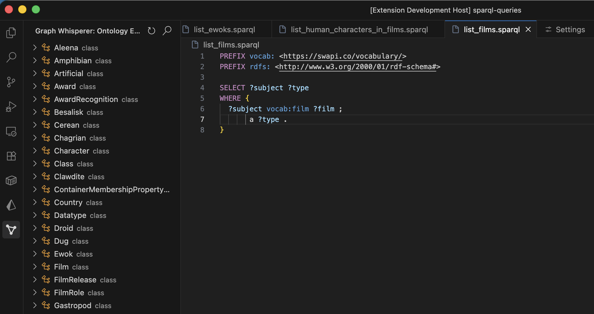

# Graph Whisperer

**Graph Whisperer** is a professional-grade VS Code extension for RDF/SPARQL development, optimized for **GraphDB**. It combines powerful query execution with an intelligent AI assistant that understands your data schema.

## Features

 
### 🧠 Intelligent SPARQL Assistant

- **Chat with your Graph**: Ask questions in natural language (e.g., _"Find all Persons who know each other"_).
- **Schema Introspection**: The agent automatically probes your endpoint to understand available classes and properties, preventing hallucinations.
- **Configurable Agent**: Customize the AI's skills and rules directly in VS Code Settings.

### 🔍 Ontology Explorer



- **Tree View**: Navigate your graph's class hierarchy and property definitions.
- **Smart Drag & Drop**: Drag a class or property into your SPARQL editor.
  - **Prefix Aware**: If your file has `PREFIX schema: <...>` defined, dragging `http://schema.org/Person` automatically inserts `schema:Person`.

### ⚡ Query Execution

- **Run Queries**: Execute `SELECT` and `CONSTRUCT` queries directly from `.sparql` files.
- **Visual Results**:
  - **Table View**: Sortable data grid for `SELECT` results.
  - **JSON View**: Interactive tree for `CONSTRUCT` results.

## Installation

### From Open VSX Registry
 
1.  Open the **Extensions** view in VS Code (`Ctrl+Shift+X`).
2.  Search for `eboraks.graph-whisperer`.
3.  Click **Install**.
 
Alternatively, visit the [Open VSX extension page](https://open-vsx.org/extension/eboraks/graph-whisperer).
 
### From Marketplace (Coming Soon)

Search for "Graph Whisperer" in the VS Code Extensions Marketplace.

### From Source

1.  **Clone the repository:**
    ```bash
    git clone https://github.com/yourusername/graph-whisperer.git
    cd graph-whisperer
    ```
2.  **Install Dependencies:**
    ```bash
    npm install
    ```
3.  **Build & Run:**
    - Press `F5` in VS Code to launch the Extension Host.

## Configuration

To connect to your GraphDB instance, go to **Settings > Extensions > Graph Whisperer**:

| Setting                   | Description                                                                                                           | Default                    |
| :------------------------ | :-------------------------------------------------------------------------------------------------------------------- | :------------------------- |
| `graphwhisperer.endpoint` | URL to your SPARQL repository (e.g., `http://localhost:7200/repositories/my-repo`)                                    | `http://localhost:7200...` |
| `graphwhisperer.username` | (Optional) Username for Basic Auth                                                                                    | `""`                       |
| `graphwhisperer.password` | (Optional) Password for Basic Auth (stored as plain text; use **Command Palette > Set Password** for better security) | `""`                       |

### Agent Configuration (New!)

You can now customize how the AI assistant behaves:

- **Introspection Skill**: Edit `graphwhisperer.agent.introspectionSkill` to change how the agent discovers your schema.
- **Rules**: Edit `graphwhisperer.agent.rules` to set custom guidelines (e.g., "Always use `schema.org` vocabulary").

## Usage Examples

### 1. Writing a Query with AI

1.  Open the Chat view (sidebar).
2.  Type: _"Show me the top 10 most used classes in this dataset."_
3.  The agent will introspect the graph and generate a valid SPARQL query.
4.  Click **Insert** to add it to your file.

### 2. Using the Ontology Explorer

1.  Open the "Graph Whisperer" sidebar.
2.  Browse the Classes tree.
3.  **Drag-and-Drop**:
    - In your editor, add `PREFIX foaf: <http://xmlns.com/foaf/0.1/>`.
    - Drag `http://xmlns.com/foaf/0.1/Person` from the tree to the editor.
    - It inserts `foaf:Person`.

## Troubleshooting

- **"Operation not permitted" (EPERM)** during `npm install`:
  This is a known local environment issue. Try cleaning the cache or running as a different user if issues persist.
