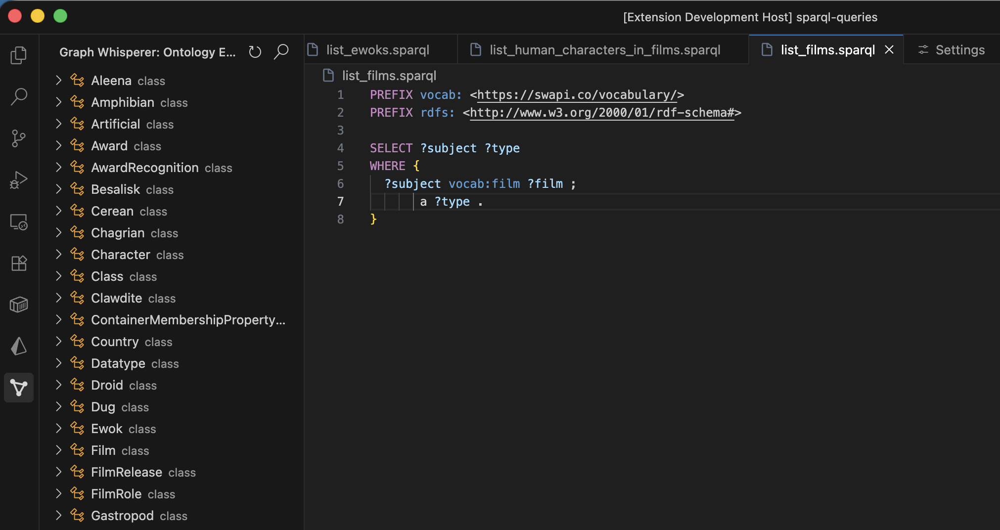

# SPARQL Whisperer

**SPARQL Whisperer** is a professional-grade VS Code extension for RDF/SPARQL development, optimized for **GraphDB**. It combines powerful query execution with an intelligent AI assistant that understands your data schema.

## Features

 
### 🧠 Intelligent SPARQL Assistant

- **Chat with your Graph**: Ask questions in natural language (e.g., _"Find all Persons who know each other"_).
- **Schema Introspection**: The agent automatically probes your endpoint to understand available classes and properties, preventing hallucinations.
- **Configurable Agent**: Customize the AI's skills and rules directly in VS Code Settings.

### 🔍 Ontology Explorer



- **Tree View**: Navigate your graph's class hierarchy and property definitions.
- **Smart Drag & Drop**: Drag a class or property into your SPARQL editor.
  - **Prefix Aware**: If your file has `PREFIX schema: <...>` defined, dragging `http://schema.org/Person` automatically inserts `schema:Person`.

### ⚡ Query Execution

- **Run Queries**: Execute `SELECT` and `CONSTRUCT` queries directly from `.sparql` files.
- **Visual Results**:
  - **Table View**: Sortable data grid for `SELECT` results.
  - **JSON View**: Interactive tree for `CONSTRUCT` results.

## Installation

### From Open VSX Registry
 
1.  Open the **Extensions** view in VS Code (`Ctrl+Shift+X`).
2.  Search for `eboraks.sparql-whisperer`.
3.  Click **Install**.
 
Alternatively, visit the [Open VSX extension page](https://open-vsx.org/extension/eboraks/sparql-whisperer).
 
### From Marketplace (Coming Soon)

Search for "SPARQL Whisperer" in the VS Code Extensions Marketplace.

### From Source

1.  **Clone the repository:**
    ```bash
    git clone https://github.com/eboraks/sparql-whisperer.git
    cd sparql-whisperer
    ```
2.  **Install Dependencies:**
    ```bash
    npm install
    ```
3.  **Build & Run:**
    - Press `F5` in VS Code to launch the Extension Host.

## Configuration

To connect to your GraphDB instance, go to **Settings > Extensions > SPARQL Whisperer**:

| Setting                   | Description                                                                                                           | Default                    |
| :------------------------ | :-------------------------------------------------------------------------------------------------------------------- | :------------------------- |
| `sparqlwhisperer.endpoint` | URL to your SPARQL repository (e.g., `http://localhost:7200/repositories/my-repo`)                                    | `http://localhost:7200...` |
| `sparqlwhisperer.username` | (Optional) Username for Basic Auth                                                                                    | `""`                       |
| `sparqlwhisperer.password` | (Optional) Password for Basic Auth (stored as plain text; use **Command Palette > Set Password** for better security) | `""`                       |

### MCP Server (Built-in)

The extension includes a built-in [MCP](https://modelcontextprotocol.io/) (Model Context Protocol) server that auto-starts when the extension activates. This gives AI agents in **Cursor**, **Claude Code**, **Windsurf**, or any MCP-compatible tool direct access to your GraphDB endpoint — using the same connection settings as the extension. No separate process or environment variables needed.

| Setting                      | Description                                          | Default |
| :--------------------------- | :--------------------------------------------------- | :------ |
| `sparqlwhisperer.mcp.enabled` | Auto-start the built-in MCP server                  | `true`  |
| `sparqlwhisperer.mcp.port`    | Port for the MCP server (SSE transport)             | `3330`  |

When running, you'll see a **`MCP :3330`** indicator in the VS Code status bar.

#### Connecting your AI tool (one-time setup)

The MCP server is available at `http://localhost:3330/sse`. You need to tell your AI tool where to find it:

**Cursor**

1. Open **Cursor Settings** > **Features** > **MCP**.
2. Click **+ Add New Server**.
3. Set **Name** to `SPARQL Whisperer`, **Type** to `sse`, and **URL** to:
   ```
   http://localhost:3330/sse
   ```
4. Click **Save**. The three tools will appear in Cursor's tool list.

**Claude Code**

Run this command in your terminal:
```bash
claude mcp add sparql-whisperer --transport sse http://localhost:3330/sse
```
Or add it manually to your project's `.mcp.json`:
```json
{
  "mcpServers": {
    "sparql-whisperer": {
      "type": "sse",
      "url": "http://localhost:3330/sse"
    }
  }
}
```

**Windsurf / Other MCP-compatible tools**

Add an SSE-type MCP server pointing to `http://localhost:3330/sse`. Refer to your tool's MCP documentation for the exact steps.

#### Available MCP tools

| Tool | Description |
| :--- | :---------- |
| `sparql_query` | Execute any SPARQL query (SELECT, CONSTRUCT, ASK, DESCRIBE, INSERT, DELETE) |
| `sparql_get_schema` | Introspect the graph schema — lists classes and properties |
| `read_query_results` | Read the latest query results from the extension (rows, triples, graph summary) without re-running queries |

> **Note:** The MCP server must be running (extension active) for AI tools to connect. If you restart VS Code, the server restarts automatically. To disable it, set `sparqlwhisperer.mcp.enabled` to `false`.

### Agent Configuration

You can customize how the AI assistant behaves:

- **Introspection Skill**: Edit `sparqlwhisperer.agent.introspectionSkill` to change how the agent discovers your schema.
- **Rules**: Edit `sparqlwhisperer.agent.rules` to set custom guidelines (e.g., "Always use `schema.org` vocabulary").

## Usage Examples

### 1. Writing a Query with AI

1.  Open the Chat view (sidebar).
2.  Type: _"Show me the top 10 most used classes in this dataset."_
3.  The agent will introspect the graph and generate a valid SPARQL query.
4.  Click **Insert** to add it to your file.

### 2. Using the Ontology Explorer

1.  Open the "SPARQL Whisperer" sidebar.
2.  Browse the Classes tree.
3.  **Drag-and-Drop**:
    - In your editor, add `PREFIX foaf: <http://xmlns.com/foaf/0.1/>`.
    - Drag `http://xmlns.com/foaf/0.1/Person` from the tree to the editor.
    - It inserts `foaf:Person`.

### 3. Chatting with Query Results

After running a query, the `@sparql` chat participant automatically has access to your latest results — including row data, triple data, and graph visualization summaries.

**Example: Exploring SELECT results**

1.  Open a `.sparql` file and run a SELECT query (`Cmd+Enter`):
    ```sparql
    SELECT ?character ?species WHERE {
      ?character a vocab:Character ;
                 vocab:species ?species .
    } LIMIT 20
    ```
2.  Open the Chat view and type:
    _"@sparql What species appear most often in these results?"_
3.  The agent sees the returned rows and answers based on your actual data.
4.  Follow up: _"@sparql Write a query that counts characters per species, sorted descending."_
    The agent uses both the ontology schema and your previous results to generate an accurate query.

**Example: Analyzing a CONSTRUCT graph**

1.  Run a CONSTRUCT query:
    ```sparql
    CONSTRUCT { ?s ?p ?o }
    WHERE { ?s a vocab:Character ; ?p ?o . }
    LIMIT 50
    ```
2.  The Graph tab shows the visualization. Ask the agent:
    _"@sparql Describe the graph structure. What types of nodes and relationships do you see?"_
3.  The agent responds with a summary of node types, edge predicates, and counts from the graph visualization data.

### 4. Graph Visualization

1.  Run a `CONSTRUCT` or graph-pattern `SELECT` query.
2.  Switch to the **Graph** tab in the results panel to see an interactive node-link diagram.
3.  Click a node to inspect its properties. Right-click to expand its neighborhood.

## Troubleshooting

- **"Operation not permitted" (EPERM)** during `npm install`:
  This is a known local environment issue. Try cleaning the cache or running as a different user if issues persist.
